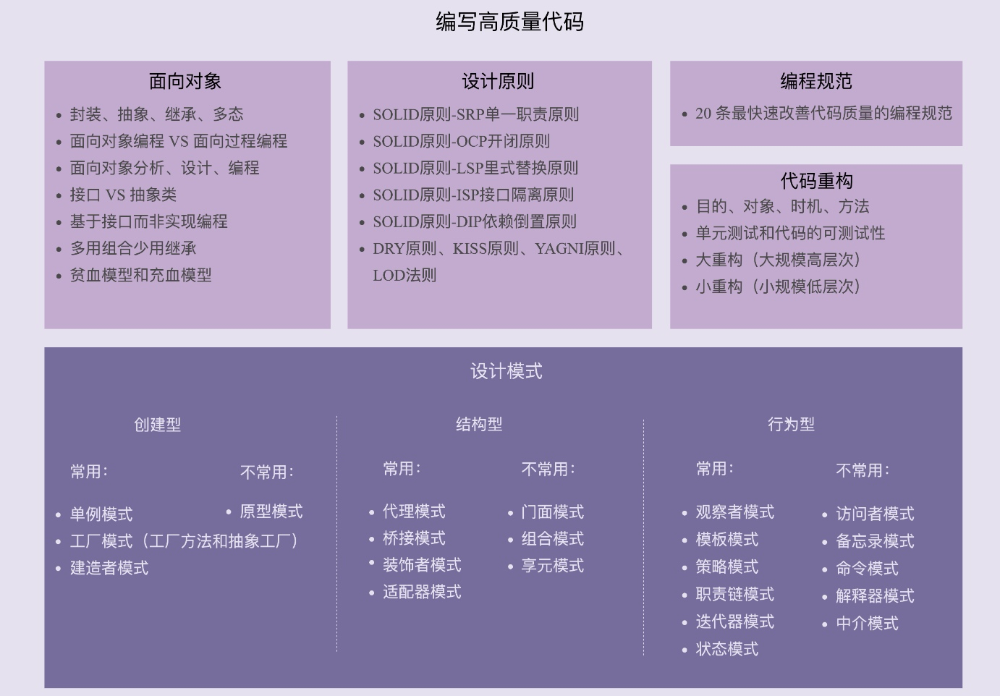

## 03 | 面向对象、设计原则、设计模式、编程规范、重构，这五者有何关系？
### 一、面向对象
1、面向对象的四大特性：封装、抽象、继承、多态  
2、面向对象编程与面向过程编程的区别和联系  
3、面向对象分析、面向对象设计、面向对象编程  
4、接口和抽象类的区别以及各自的应用场景  
5、基于接口而非实现编程的设计思想  
6、多用组合少用继承的设计思想  
7、面向过程的贫血模型和面向对象的充血模型

### 二、设计原则
1、SOLID原则-SRP单一职责原则  
2、SOLID原则-OCP开闭原则  
3、SOLID原则-LSP里氏替换原则  
4、SOLID原则-ISP接口隔离原则  
5、SOLID原则-DIP依赖倒置原则  
6、DRY原则、KISS原则、YAGNI原则、LOD法则

### 三、设计模式
1、创建型  
常用：单例模式、工厂模式(工厂方法和抽象工厂)、建造者模式  
不常用：原型模式  
2、结构型  
常用：代理模式、桥接模式、装饰者模式、适配器模式  
不常用：门面模式、组合模式、享元模式  
3、行为型  
常用：观察者模式、模板模式、策略模式、责任链模式、迭代器模式、状态模式  
不常用：访问者模式、备忘录模式、命名模式、解释器模式、中介模式

### 四、编程规范

### 五、代码重构
1、重构的目的(why)、对象(what)、时机(when)、方法(how)  
2、保证重构不出错的技术手段：单元测试和代码的可测试性  
3、两种不同规模的重构：大重构(大规模高层次)和小重构(小规模低层次)

### 六、五者之间的联系

