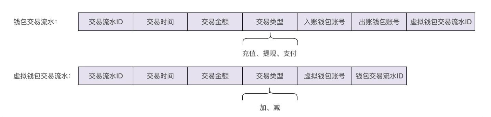

## 12 | 实战一（下）：如何利用基于充血模型的DDD开发一个虚拟钱包系统？
### 一、钱包业务背景介绍
1、充值  
2、支付  
3、提现  
4、查询余额  
5、查询交易流水

### 二、钱包系统的设计思路

### 三、总结
1、基于充血模型的DDD开发模式跟基于贫血模型的传统开发模式相比，主要区别在Service层。在基于充血模型的开发模式下，将部分原来在Service类中的业务逻辑移动到一个充血的Domain领域模型中，让Service类的实现依赖这个Domain类。   
2、在基于充血模型的DDD开发模型下，Service类并不会完全移除，而是负责一些不适合放在Domain类中的功能。比如负责与Repository层打交道、跨领域模型的业务聚合功能、幂等事务等非功能性的工作。  
3、基于充血模型的DDD开发模式跟基于贫血模型的传统开发模式相比，Controller层和Repository层的代码基本上相同。因为Repository层的Entity生命周期有限，Controller层的VO只是单纯作为一种DTO。两部分的业务逻辑都不会太复杂。业务逻辑主要集中在Service层。所以Repository层和Controller层继续沿用贫血模型的设计思路是没有问题的。  