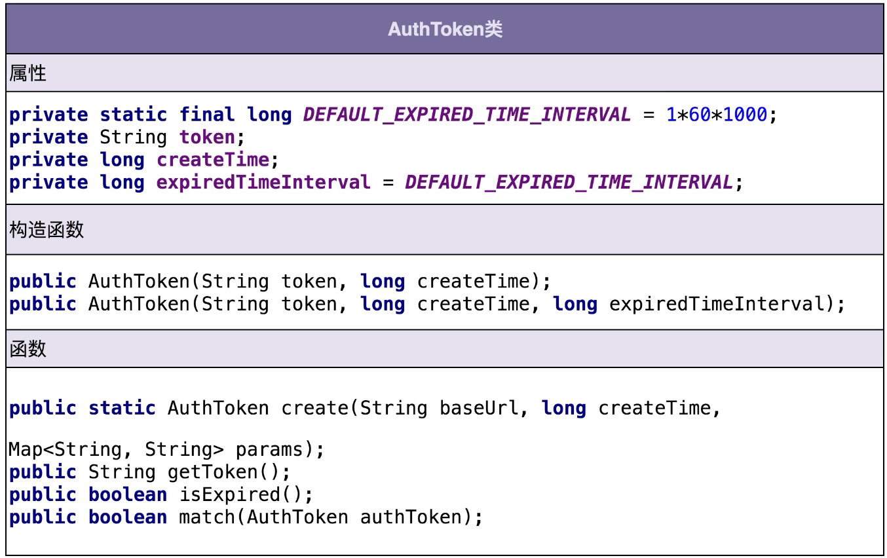
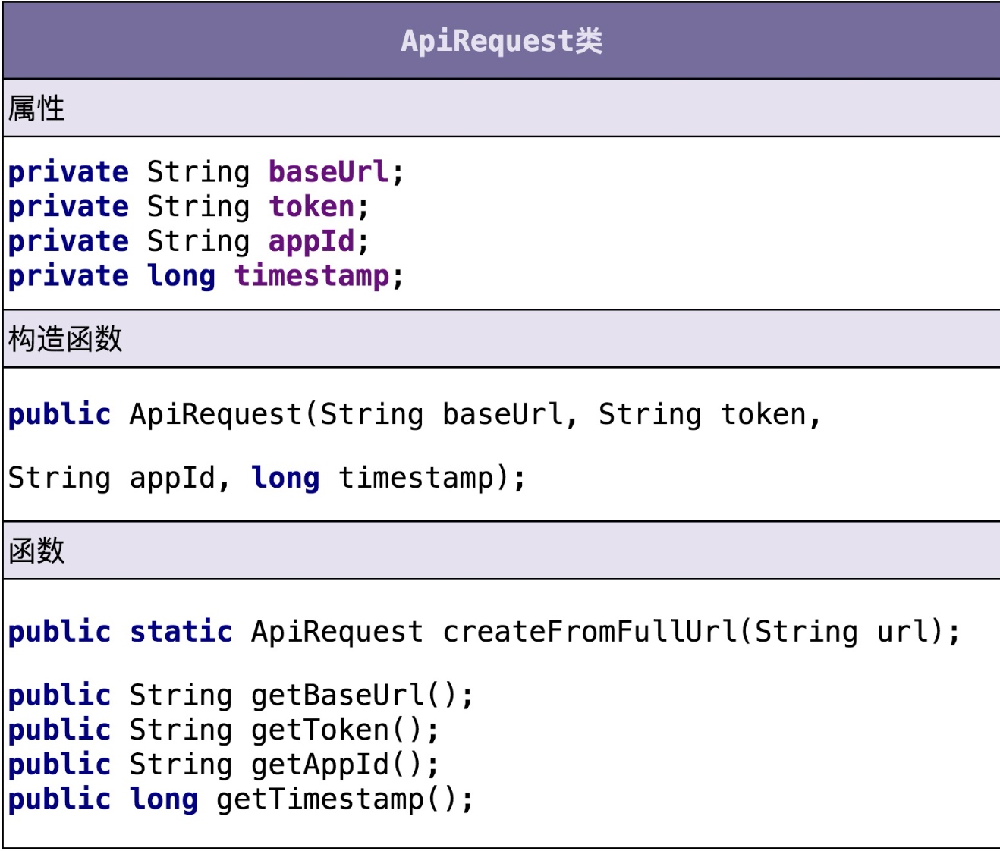
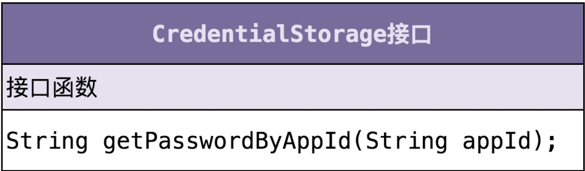
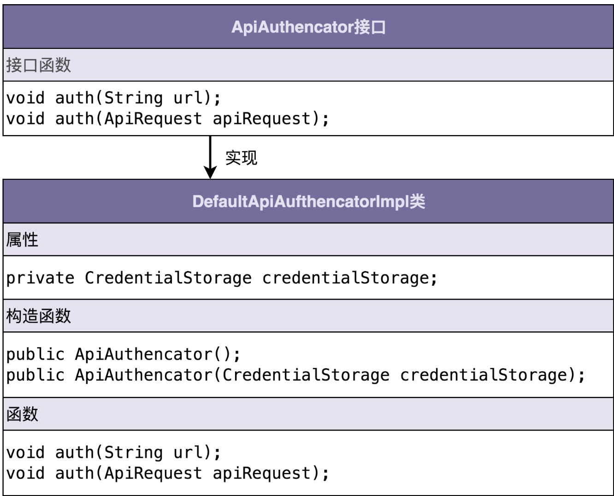

## 14 | 实战二（下）：如何利用面向对象设计和编程开发接口鉴权功能？
面向对象分析的产出是详细的需求描述，面向对象设计的产出就是类。
### 一、如何进行面向对象设计？
#### 划分指责进而识别出有哪些类
思路：  
1、根据需求描述，把其中涉及的功能点，一个个罗列出来，然后再去看哪些功能点指责相近，操作同样的属性，可否应该归为同一个类。  
案例：  
1、根据上章的需求描述，拆解成小的功能点，一条一条罗列下来。  
(1)把URL、AppID、密码、时间戳拼接为一个字符串。   
(2)对字符串通过加密算法加密生成token。    
(3)将token、AppID、时间戳拼接到URL中，形成新的URL。  
(4)解析URL，得到token、AppID、时间戳等信息。  
(5)从存储中取出AppID和对应的密码。  
(6)根据时间戳判断token是否过期失效。  
(7)验证两个token是否匹配。  
2、从上面发现，1、2、6、7都是跟token相关的，负责token的生成、验证等。3、4都是在处理URL，负责URL的拼接、解析。5是操作AppID和密码，负责从存储中读取AppID和密码。  
3、可以粗略地得到三个核心类：AuthToken、Url、CredentialStorage。AuthToken负责实现1、2、6、7四个操作，Url负责3、4两个操作，CredentialStorage负责5操作。  
4、先初步的划分类，其他边边角角的之后再处理，面向对象分析、设计编程是一个循环迭代、不断优化的过程。  
5、如果是比较复杂的需求开发，可以先按照功能模块划分，再进行上述面向对象设计。

#### 定义类及其属性和方法
1、AuthToken  

2、Url  

3、CredentialStorage  

#### 定义类与类之间的交互关系
1、UML统一建模语言中定义了6种类之间的关系。  
(1)泛化：可以简单理解成继承关系。  
(2)实现：一般指接口和实现类之间的关系。  
(3)聚合：一种包含关系，A类对象包含B类对象，B类对象的生命周期可以不依赖A类对象的生命周期，单独销毁A类对象而不影响B对象。比如课程和学生之间的关系。  
(4)组合：也是一种包含关系，A类对象包含B类对象，B类对象的生命周期依赖A类对象的生命周期，B类对象不可单独存在，比如鸟和翅膀之间的关系。  
(5)关联：一种非常弱的关系，包含聚合、组合两种关系。  
(6)依赖：一种比关联关系更加弱的关系，包含关联关系。只要B类对象和A类对象有任何使用关系，都称为它们有依赖关系。
2、CredentialStorage和MysqlCredentialStorage是实现关系。

#### 将类组装起来并提供执行入口

### 二、如何进行面向对象编程？
