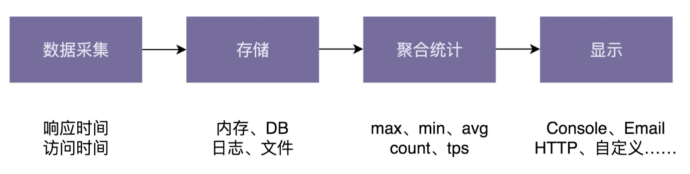

## 25 | 实战二（上）：针对非业务的通用框架开发，如何做需求分析和设计？
### 一、项目背景
设计一个能够获取接口调用的各种统计信息的框架。

### 二、需求分析
1、功能性需求分析  
(1)接口统计信息：包括接口响应时间的统计信息，以及接口调用次数的统计信息等。    
(2)统计信息的类型：max、min、avg、percentile、count、tps等。  
(3)统计信息显示格式：json、html、自定义显示格式。  
(4)统计信息显示终端：console、email、http网页、日志、自定义显示终端。  
2、非功能性需求分析  
易用性、性能、扩展性、容错性、通用性等。

### 三、框架设计
对于复杂框架的设计，可以使用画产品线框图、聚集简单应用场景、设计实现最小原型、画系统设计图等技巧让问题简化、具体、明确。

