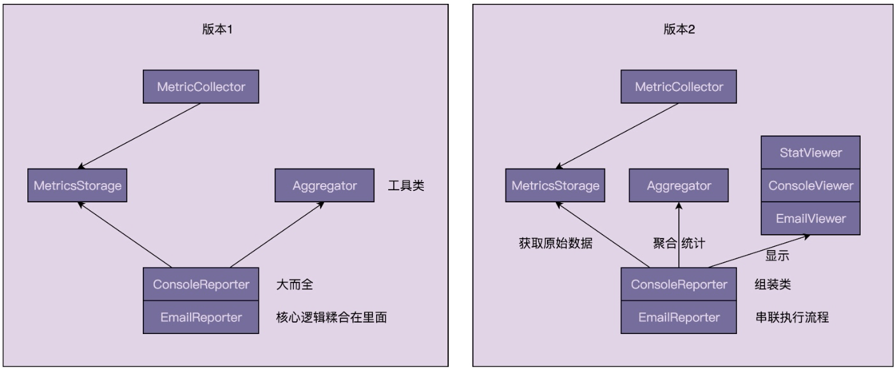

## 39 | 运用学过的设计原则和思想完善之前讲的性能计数器项目（上）
### 一、回顾版本1的设计与实现
1、Aggregator类存在的问题   
(1)当添加新的统计功能时，代码的可读性、可维护性变差。   
2、ConsoleReporter和EmailReporter的问题   
(1)这两个类中存在代码重复，从数据库、做统计的逻辑都是相同的。    
(2)整个类负责的比较多，不想干的逻辑糅合在里面，职责不够单一。  
(3)代码中涉及线程操作，并且调用静态函数，代码的可测试性不高。

### 二、针对版本1的问题进行重构
1、根据给定时间区间，从数据库中拉取数据。这部分逻辑已经被封装在MetricsStorage类中，无需处理。  
2、根据原始数据，计算得到统计数据。可以将这部分逻辑移动到Aggregator类中。  
3、将统计数据显示到终端。可以将这部分逻辑抽离出来，设计两个类：ConsoleViewer和EmailViewer类，分别负责将统计结果显示到命令行和邮件中。  
4、组装类并定时触发执行统计显示。

### 三、Review版本2的设计与实现
