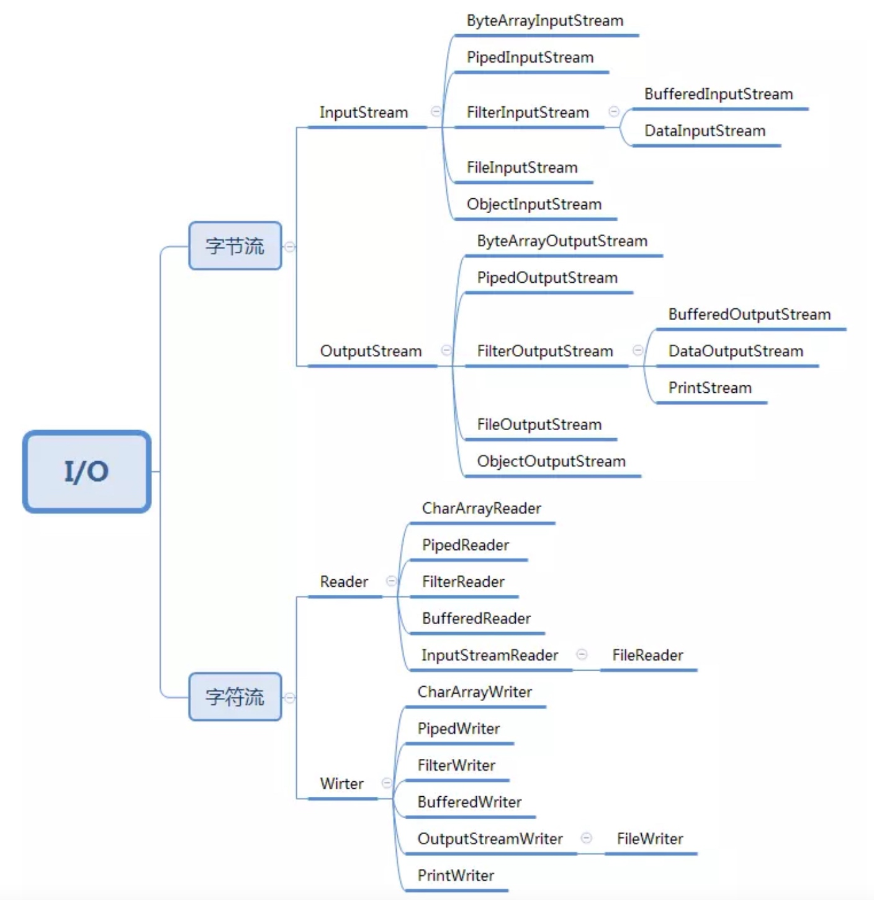

## 50 | 装饰器模式：通过剖析Java IO类库源码学习装饰器模式
### 一、Java IO类的“奇怪”用法

1、使用Java IO时，需要先创建一个FileInputStream对象，然后再传递给BufferedInputStream对象来使用，为什么不设计一个继承FileInputStream并且支持缓存的BufferedFileInputStream类呢？

### 二、基于继承的设计方案
1、如果InputStream只有一个子类FileInputStream的话，在FileInputStream基础之上再设计一个BufferedInputStream，也是可以的，但继承InputStream子类有很多，需要给每个子类创建支持缓存的孙子类，并且除了支持缓存之外，还需要对其他功能进行增强，这样就会导致类结构变得无比复杂，代码不好扩展和维护。

### 三、基于装饰器模式的设计方案
1、装饰器模式主要解决继承关系过于复杂的问题，通过组合来替代继承，它主要的作用是给原始类添加增强功能，而代理模式是附加跟原始类无关的功能。    
2、装饰器模式还有一个特点是可以对原始类嵌套使用多个装饰器，但需要装饰器类和原始类继承相同的抽象类和接口。    