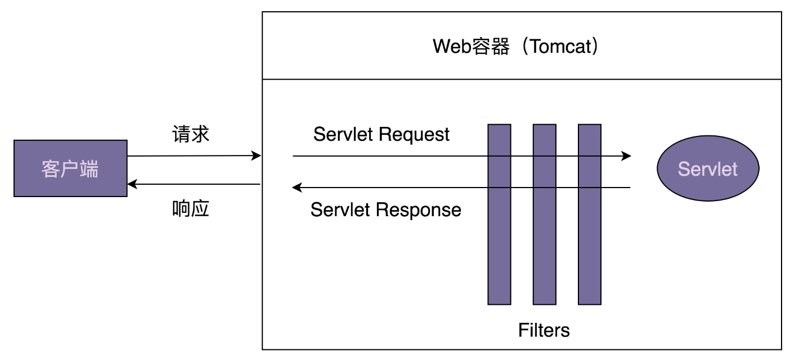
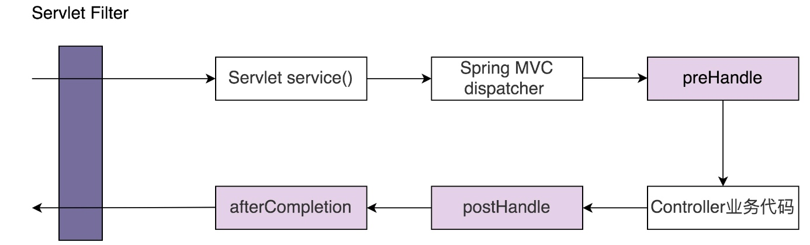

## 63 | 责任链模式（下）：框架中常用的过滤器、拦截器是如何实现的？
1、责任链模式常用在框架的开发中，为框架提供扩展点，让框架的使用者在不修改框架源码的情况下，基于扩展点添加新的功能。最常用来开发框架的过滤器和拦截器。

### 一、Servlet Filter
1、Servlet Filter是Java Servlet规范中定义的组件，它可以实现对HTTP请求的过滤功能，比如鉴权、限流、记录日志、验证参数等等。因为它是Servlet规范的一部分，所以只要是支持Servlet的Web容器(比如Tomcat、Jetty)都支持过滤器功能。  

2、Servlet只是一个规范，并不包含具体的实现，所以Servlet中的FilterChain只是一个接口定义，具体的实现类由遵从Servlet规范的Web容器来提供，比如ApplicationFilterChain类就是Tomcat提供的FilterChain实现类。

### 二、Spring Interceptor
1、拦截器和过滤器基本上可以看作一个概念，都用来实现对HTTP请求进行拦截处理。它们不同之处在于，Servlet Filter是Servlet规范的一部分，实现依赖于Web容器， Spring Interceptor是Spring MVC框架的一部分，由Spring MVC框架来实现。  
2、客户端发送的请求会先经过Servlet Filter再经过Spring Interceptor，最后到达具体的业务代码中。

