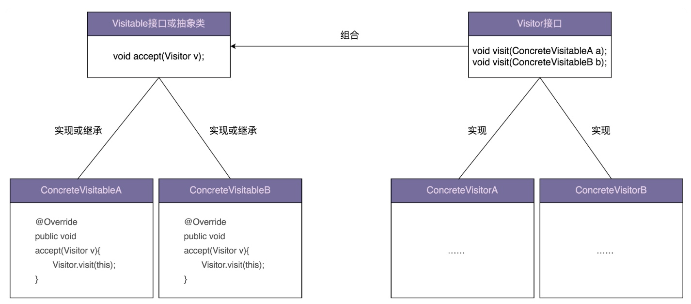

## 68 | 访问者模式（上）：手把手带你还原访问者模式诞生的思维过程
### 一、访问者模式
1、Allows for one or more operation to be applied to a set of objects at runtime，decoupling the operations from the object structure.  
2、访问者模式：允许一个或者多个操作应用到一组对象上，解耦操作和对象本身。  
3、优点：保持类职责单一、满足开闭原则以及应对代码的复杂性。  
