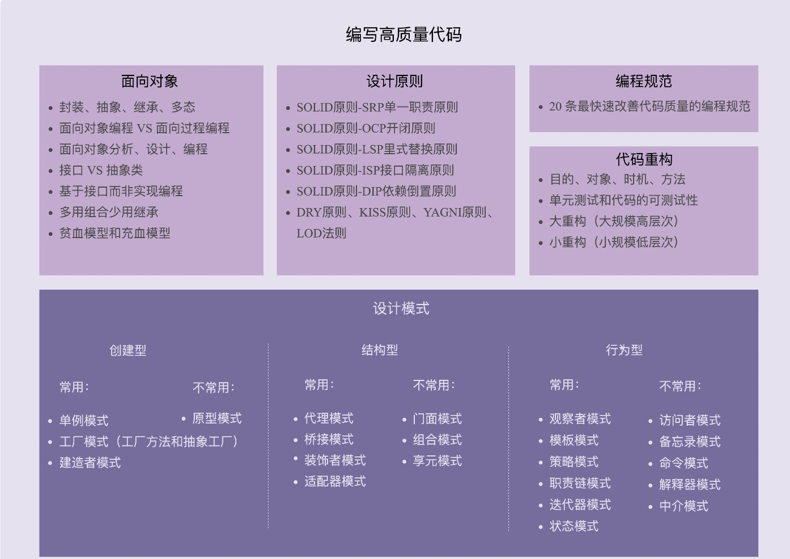

## 74 | 总结回顾23种经典设计模式的原理、背后的思想、应用场景等
1、创建型设计模式主要解决“对象的创建问题”，结构型设计模式主要解决“类或对象的组合”问题，行为型设计模式主要解决的是“类或对象之间的交互”问题。

### 一、创建型设计模式
1、单例模式.
2、工厂模式.
3、建造者模式.
4、原型模式.

### 二、结构型模式
1、代理模式.
2、桥接模式.
3、装饰器模式.
4、适配器模式.
5、门面模式.
6、组合模式.
7、享元模式.

### 三、行为型设计模式
1、观察者模式.
2、模板模式.
3、策略模式.
4、责任链模式.
5、迭代器模式.
6、状态模式.
7、访问者模式.
8、备忘录模式.    
9、命令模式.
10、解释器模式.
11、中介模式.

