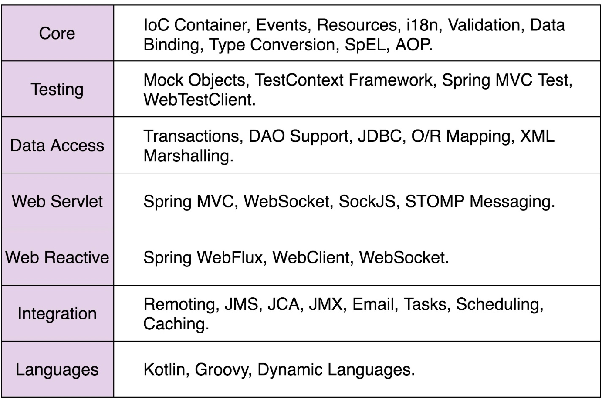
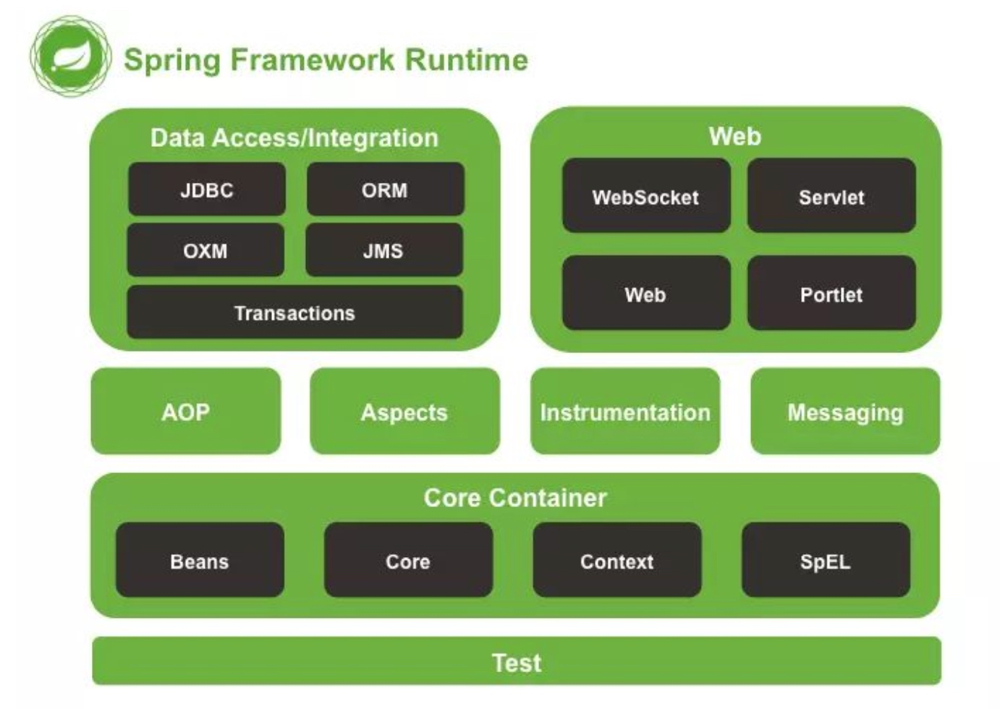

## 84 | 开源实战四（上）：剖析Spring框架中蕴含的经典设计思想或原则
### 一、Spring框架简单介绍
1、常说的Spring框架，指的是Spring Framework基础框架。Spring Framework是整个Spring生态的基石。除了Spring Framework，Spring全家桶还有更多基于Spring Framework开发出来的、整合更多功能的框架，比如Spring Boot、Spring Cloud。

### 二、从Spring看框架的作用
1、利用框架的好处(简化开发)：   
(1)解耦业务与非业务开发、让程序员聚集在业务开发上。    
(2)隐藏复杂实现细节、降低开发难度、减少代码bug。    
(3)实现代码复用、节省开发时间。    
(4)规范化标准化项目开发、降低学习和维护成本。  

### 三、Spring框架蕴含的设计思想
1、约定优于配置.  
(1)如何简化配置？一是基于注解，一是基于约定。  
(2)基于约定的配置方式，通过约定的代码结构或者命名来减少配置，即提供配置的默认值，优先使用默认值。  
2、低侵入、松耦合.  
(1)低侵入指的是框架代码很少耦合在业务代码中，低侵入意味着需要替换框架时，对原有的业务代码改动会很少。例如Spring提供的IOC容器，在不需要Bean继承任何父类或者实现任何接口的情况下，仅仅通过配置，就能将它们纳入进Spring的管理中，如果需要替换IOC容器，也只是重新配置一下，原有Bean都不需要任何修改。  
3、模块化、轻量级.  
(1)Spring在分层、模块化方面做得很好，每个模块都只负责一个相对独立的功能。模块之间关系，仅有上层对下层的依赖关系，而同层之间以及下层对上层，几乎没有依赖和耦合。并且每个模块都非常轻量级，都可以单独拿来使用。  

4、再封装、再抽象.  
(1)Spring不仅仅提供了各种Java项目开发的常用功能模块，而且还对市面上主流的中间件、系统的访问类库，做了进一步的封装和抽象，提供了更高层次、更统一的访问接口。  