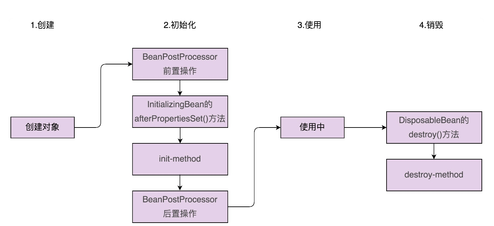

## 85 | 开源实战四（中）：剖析Spring框架中用来支持扩展的两种设计模式
### 一、观察者模式在Spring中的应用
1、Spring中实现的观察者模式包含三部分：Event事件(消息)、Listener监听者(观察者)、Publisher发送者(被观察者)。    
2、定义一个继承ApplicationEvent的事件，定义一个实现了ApplicationListener的监听器，定义一个发送者，发送者调用ApplicationContext来发送事件消息。   
3、其中观察者注册到了ApplicationContext对象中，真正的消息发送，实际上通过ApplicationEventMulticaster这个类来完成的。它通过线程池，支持异步非阻塞、同步阻塞这两种类型的观察者模式。

### 二、模板模板在Spring中的应用
1、Spring Bean的创建过程，可以大致分为两大步：对象的创建和对象的初始化。利用模板模式，Spring能让用户定制Bean的创建过程。  
2、对象的初始化有两种实现方式：  
(1)一种是在类中自定义一个初始化函数，并且通过配置文件，显式地告知Spring，哪个函数是初始化函数。缺点是需要通过反射在运行时动态地调用，影响代码执行的性能。  
(2)一种是让类实现InitializingBean接口，重写afterPropertiesSet()方法。Spring在初始化Bean时，通过调用bean.afterPropertiesSet()的方式，调用Bean对象上的这个函数。缺点是会和业务代码耦合，替换框架成本变高。  
3、销毁过程跟初始化过程非常相似，也有两种实现方式。一种是通过配置destroy-method指定类中的销毁函数，一种是让类实现DisposableBean接口。 
